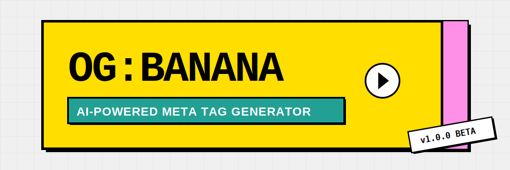

<p align="center">
  
</p>

# OG:BANANA

AI‑powered Open Graph (OGP) meta‑tag and social preview image generator for your links, built on React, Vite, Appwrite Functions, and Google Gemini.

The web app lets you paste a URL + optional context and returns:

- SEO‑friendly `<title>` and `meta` description
- Full Open Graph + Twitter Card tags
- A 1200×630 AI‑generated preview image that matches your site’s vibe
- Copy‑pasteable HTML snippet ready for your `<head>`

Behind the scenes, Appwrite cloud functions handle scraping, AI calls, and a credit‑based usage system.

## What It Does

- **Frontend generator UI** (`/src`) where you:
  - Sign in and see remaining credits
  - Input a target URL and optional context/keywords
  - Preview the generated social cards and full meta‑tag HTML
- **`generateOgpData` function** (`functions/generateOgpData`):
  - Scrapes the target page
  - Uses Gemini to generate meta tags and an OGP image
  - Compresses the image and returns structured OGP data
- **`limit-resetter` function** (`functions/limit-resetter`):
  - Scheduled Appwrite function that resets user credits based on plan
  - Supports a simple free vs pro usage model
- **`createPrefs` function** (`functions/createPrefs`):
  - Webhook‑style Appwrite function subscribed to `users.*.create`
  - Seeds every new user with `plan: "free"` and `credits: 5` so the UI has defaults immediately

## How to Run Locally

### Prerequisites

- Node.js 18+ and `pnpm` installed
- An Appwrite project with the functions from `appwrite.json` deployed
- A configured `.env` / environment for Appwrite SDK in the frontend

### Frontend (Vite + React)

```bash
pnpm install
pnpm dev
```

Then open the printed `http://localhost:5173` (or similar) URL in your browser.

Key scripts (from `package.json`):

- `pnpm dev` – start the Vite dev server
- `pnpm build` – type‑check and build for production
- `pnpm preview` – run the built app locally
- `pnpm lint` – run ESLint

### Appwrite Functions

This repo includes three functions referenced in `appwrite.json`:

1. **`generateOgpData`** (`functions/generateOgpData`)

   - Runtime: Node 18
   - Entrypoint: `src/main.js`
   - Install deps:

     ```bash
     cd functions/generateOgpData
     npm install
     ```

   - Requires `GEMINI_API_KEY` and Appwrite function env vars (`APPWRITE_FUNCTION_API_ENDPOINT`, `APPWRITE_FUNCTION_PROJECT_ID`).

2. **`limit-resetter`** (`functions/limit-resetter`)

   - Runtime: Bun 1.x
   - Entrypoint: `src/main.ts`
   - Install deps:

     ```bash
     cd functions/limit-resetter
     bun install
     ```

- Scheduled via `appwrite.json` (e.g. monthly) to reset user limits.

3. **`createPrefs`** (`functions/createPrefs`)

- Runtime: Bun 1.x
- Entrypoint: `src/main.ts`
- Install deps:

  ```bash
  cd functions/createPrefs
  bun install
  ```

- Subscribe it to `users.*.create` events so Appwrite calls it whenever an account is created
- Requires the standard Appwrite env vars (`APPWRITE_FUNCTION_API_ENDPOINT`, `APPWRITE_FUNCTION_PROJECT_ID`) and an admin key sent via `x-appwrite-key` so it can call `users.updatePrefs`

Deploy these from the Appwrite Console or CLI, then update the frontend Appwrite config in `src/lib/appwrite.ts` and constants in `src/lib/constants.ts` as needed.

## Contributing

Contributions, bug reports, and feature ideas are welcome.

1. Fork the repo and create a feature branch
2. Install dependencies with `pnpm install`
3. Run `pnpm dev` while you work
4. Add or update tests/linters where relevant (`pnpm lint`)
5. Open a pull request with a clear description of your changes

## License

This project is available under a **dual license**:

- **Open Source**: GNU Affero General Public License v3 (AGPLv3)
- **Commercial**: A separate commercial license for proprietary use

By default, using or hosting modified versions of OG:BANANA over a network under the open‑source terms requires your changes to be AGPLv3‑compatible. For commercial licensing inquiries, please contact the author (see repository profile).

See [`LICENSE`](/LICENSE) for full details.
